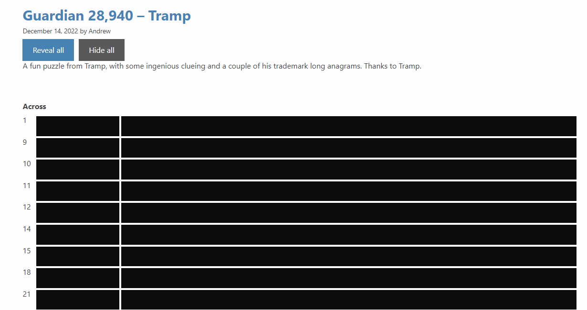

# Fifteensquared Spoiler

Hides all answers and explanations for cryptic crosswords on [Fifteensquared](https://fifteensquared.net/). This script aims to let you find help with parsing an answer you found, or get a single answer while you're completely stumped without accidentally seeing other answers before you're ready.

## Requirements

-   A userscript manager such as [Tampermonkey](https://www.tampermonkey.net/)

## Installation

-   Open the [latest user script](../../releases/latest/download/fifteensquared-spoiler.user.js)
-   Click install

## Usage

Click on a blocked-out answer to reveal it. Click again to block it out again. Answers and explanations can be revealed separately. Use the "reveal all" and "hide all" buttons to control all items at once.

Your browser will save which answers you have previously revealed if you close the page and come back later.
